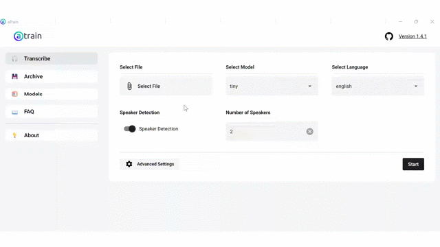
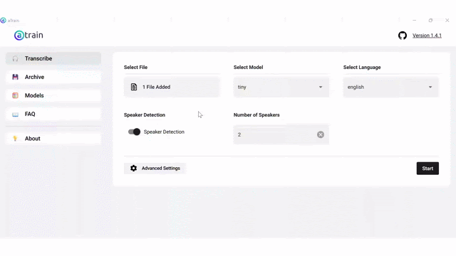
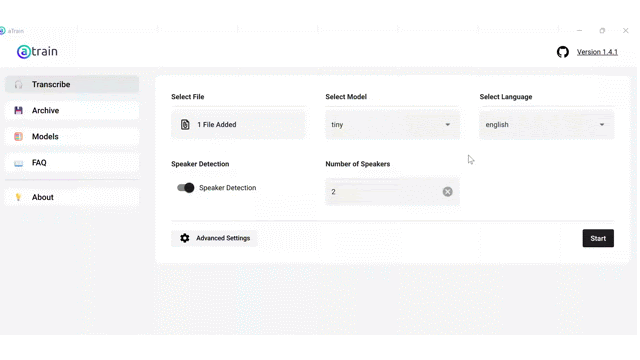
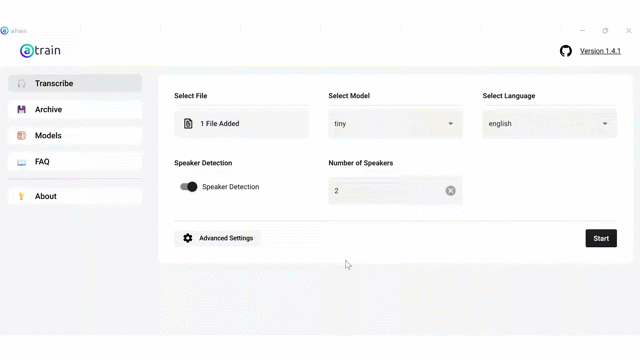

# aTrain Transcription Activity

aTrain is a transcription software that uses open-source AI models to transcribe audio files, runs locally on your computer, and therefore does not rely on any cloud-based services. In addition, aTrain can detect speakers. When using aTrain, you can choose which model you want to use to transcribe your file: simpler models will transcribe faster but might make more mistakes, while larger models are more accurate but take more time. If you want to know about the differences in error rates and run time for each model, or about aTrain in general, check out their [research paper](https://doi-org/10.1016/j.jbef.2024.100891){:target="_blank"}. In fact, **if you are using aTrain for research, you should cite the paper above**.

To transcribe a file using aTrain, follow the steps below.

1. If you are using Windows, download aTrain from the [Microsoft Store](https://apps.microsoft.com/detail/9N15Q44SZNS2?hl=en-us&gl=US){:target="_blank"}. You won't need admin permission to download aTrain, but if you have Microsoft Store disabled for some reason, you can also download it directly from [here](https://business-analytics.uni-graz.at/en/research/atrain/download/?hl=en-us&gl=US){:target="_blank"}. If you are on a Mac, you can also download aTrain from [this link](https://business-analytics.uni-graz.at/en/research/atrain/download/?hl=en-us&gl=US){:target="_blank"}, but it will only work on Macs that use Apple Silicon processors.
   
2. Open the aTrain app.
     
3. In the main page, under **Select file**, click on **Select File** to select the file you want to transcribe. If you don’t have an MP3 audio file to transcribe please download one of the following files and make note of which folder your web browser places in on your computer:
  - [6-minute interview for older computers](https://uviclibraries.github.io/transcription/media/makerspaces-6m.mp3){:target="_blank"}.
  - [30-minute interview for newer computers](https://uviclibraries.github.io/transcription/media/makerspaces-30m.mp3){:target="_blank"}.
     
   
5. Under **Select model**, choose the model you want to use. We recommend starting with the tiny model, which is the simplest. If you don't see the option for the tiny model, you need to first download it. To do this, click on **Models** on the left tab, and then click on **Download** to download the tiny model or whatever model you want. You might need to restart aTrain and/or reselect your file for the changes to take effect.
     
   
6. Back to the **Transcribe** window, choose the language of the file under **Select language**, select if you want speaker detection or not (we recommend that you choose speaker detection), type in the number of speakers, and then click on **Start** to start transcribing!
     
   
7. Once the transcription is done, the app will automatically open the folder where the transcription was saved. The file named "transcription.txt" is the transcribed file. You can now copy the text into Microsoft Word or your text editor of choice to visualize and clean/edit it!
   
8. The aTrain app also saves your past transcription, so if you forgot where it was saved, you can click the **Archive** button on the left panel, then ask aTrain to **open** the transcribed file.
     

Congratulations! You just transcribed your first file using aTrain!

[NEXT: Earn a badge](informal-credentials.md){: .btn .btn-blue }
