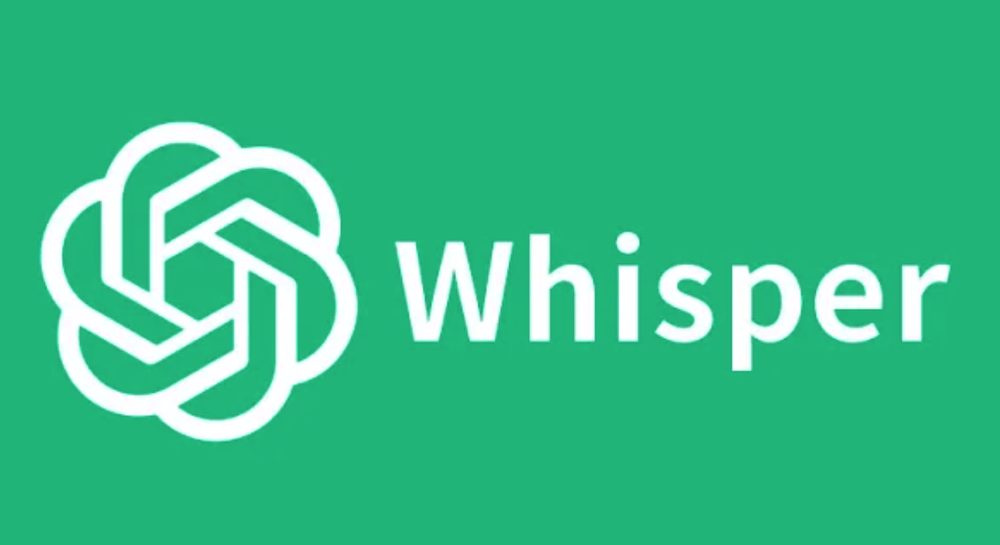

# Transcription with Whisper.ai and Microsoft 365

- Introductory presentation: 10 min
- Hands-on activities: 30-40 min

## Why use transcription services?

Automated transcription services can help save time in qualitative research. While there are many options available, [Microsoft 365](https://support.microsoft.com/en-us/office/transcribe-your-recordings-7fc2efec-245e-45f0-b053-2a97531ecf57), [Whisper Transciption](https://apps.apple.com/us/app/whisper-transcription/id1668083311?mt=12), and [Zoom](https://support.zoom.com/hc/en/article?id=zm_kb&sysparm_article=KB0064927) are services that are free for UVic students and faculty. When choosing transcription services to use, one should also take into account the pros, cons, and research ethics considerations that are specific to each service.

## Learning Objectives

- Describe the benefits and use cases for transcribing audio with Microsoft 365, Whisper.ai, and Zoom compared to other transcription technologies
- Setup (if necessary) and open Microsoft Word 365 in a web browser on your computer (not the installed Word application)
- Setup (if necessary) and open Whisper Transcription on your computer
- Describe the benefits and use cases for transcribing audio with Whisper.ai compared to other transcription technologies
- Transcribe an audio file
- Export transcription in two or more different formats
 
[NEXT STEP: Pre-Workshop Activities](pre-workshop.html){: .btn .btn-blue }
