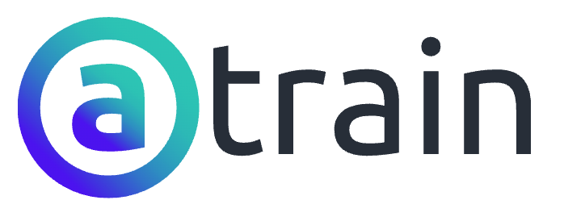

# Transcription with Microsoft 365, Zoom & aTrain

- Introductory presentation: 10 min
- Hands-on activities: 30-40 min

## Why use transcription services?

Automated transcription services can help save time in qualitative research. While there are many options available, **[Microsoft 365 transcription](https://support.microsoft.com/en-us/office/transcribe-your-recordings-7fc2efec-245e-45f0-b053-2a97531ecf57){:target="_blank"}** and **[Zoom](https://support.zoom.com/hc/en/article?id=zm_kb&sysparm_article=KB0064927){:target="_blank"}** are services that are free for UVic students and faculty. 

An open source free transcription software tool that runs on your laptop and not in the cloud is **aTrain [Mac](https://apps.apple.com/us/app/whisper-transcription/id1668083311?mt=12){:target="_blank"} & [Windows](https://apps.microsoft.com/detail/9N15Q44SZNS2?mode=direct){:target="_blank"}** (based on the [Whisper trainscription open source project](https://github.com/openai/whisper){:target="_blank"}). UVic and the DSC do not endorse aTrain, so before using it for any research, please consult with the helpful folks at [UVic's Human Research Ethics office](https://www.uvic.ca/research-services/ethics-and-compliance/human-ethics/index.php){:target="_blank"}. 

When choosing transcription services to use, one should also take into account the pros, cons, and research ethics considerations that are specific to each service. **You should alwasy include the transcription tool you are using in your research ethics application**.

## Learning Objectives

- Describe the benefits and use cases for transcribing audio with Microsoft 365, aTrain, and Zoom compared to other transcription technologies
- Setup (if necessary) and open Microsoft Word 365 in a web browser on your computer (not the installed Word application)
- Setup (if necessary) and open aTrain Transcription on your computer
- Transcribe an audio file using one of the tools from the workshop.
- Export transcription in two or more different formats
 
[NEXT STEP: Pre-Workshop Activities](pre-workshop.html){: .btn .btn-blue }
