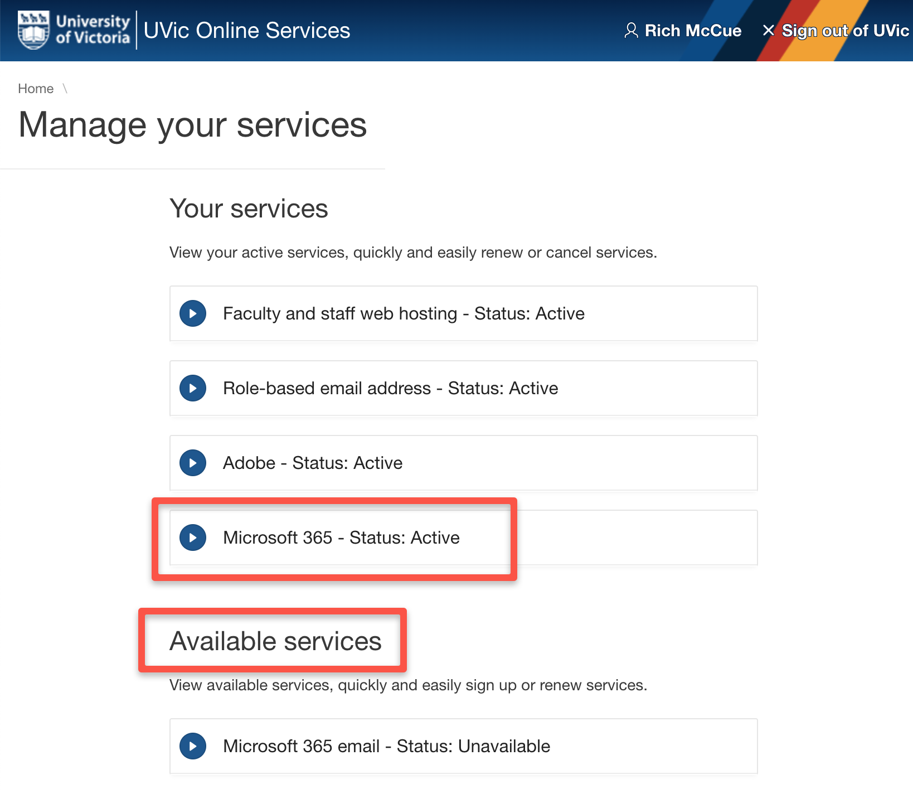
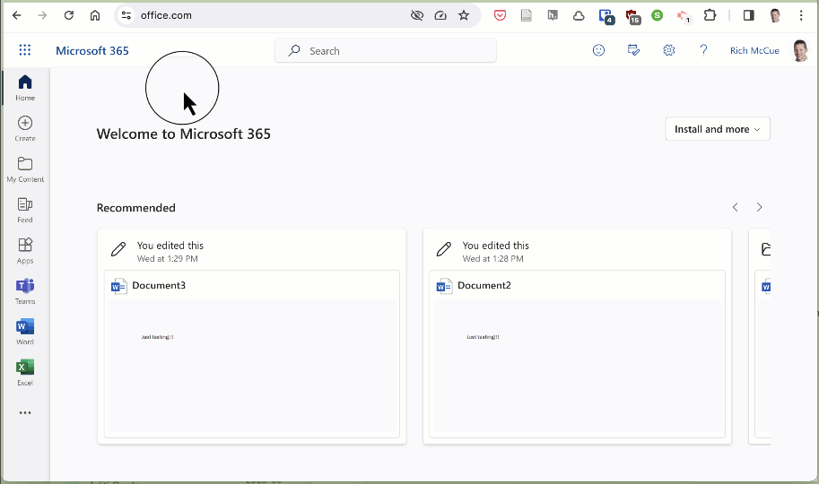

# UNDER CONSTRUCTION!
# Meeting Notes with Zoom & Microsoft Copilot

In this activity you will learn how to transcribe staff meeting audio, and then create a bullet point summary of the meeting using the UVic licensed version of Microsoft CoPilot (which UVic has negociated additional privacy protections than come with the regular version of Co-Pilot

1. Setup Microsoft 365 (if you haven’t done so already):

  a. Sign Up For a UVic student license for Microsoft 365 here: OnlineServices.uvic.ca 

  b. Wait 2-minutes & then log into Office 365 with your UVic email address: portal.office.com 
  c. If you are in a face-to-face workshop and you have any problems signing up for the UVic-licensed version of Microsoft 365 or accessing it, please ask your instructor for assistance. If you are working through this on your own and are having problems, please contact the UVic helpdesk: helpdesk@uvic.ca 

2. Transcribe an audio file from a Zoom interview:

  a. Make sure you’re signed into  Microsoft 365, using the new Microsoft Edge or Chrome web browser.
  b. Open Word in the left nav bar and then create a new Blank document.

  c. Go to  Dictate then click on the dropdown, then Transcribe.

  d. If you don’t have an MP3 audio file to transcribe, [download this file](https://uviclibraries.github.io/transcription/media/makerspaces.mp3){:target="_blank"}.
  e. Choose an audio file from the file picker (if you downloaded the file above then it is called: makerspaced.mp3 (The Microsoft 365 transcription service currently supports .wav, .mp4, .m4a, .mp3 formats). In the Transcribe pane, select Upload audio.

  f. Transcription may take a while depending on your internet speed, up to about the length of the audio file. Be sure to keep the Transcribe pane open while the transcription is happening, but feel free to do other work or switch browser tabs or applications and come back later.

3. Add the transcription to your file, by selecting Add to document, and then clicking on, With speakers. Note that there are multiple formats, but for researchers, the most popular format is “With speakers”

4. Great job! You’ve just transcribed your first audio file with Microsoft 365!
